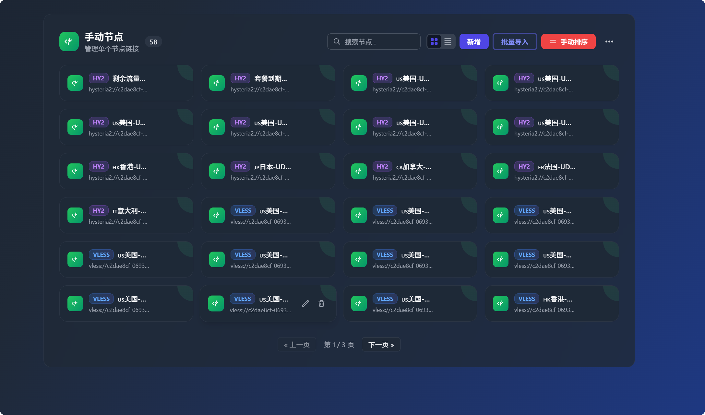

# Sub-One Manager

> 🚀 基于 Vue.js 3 的现代化订阅管理工具，专为 Cloudflare Pages 设计

[](https://vuejs.org/)
[](https://www.typescriptlang.org/)
[](https://tailwindcss.com/)
[](https://pages.cloudflare.com/)
[](LICENSE)

## 📝 更新日志 (v2.0)

- **⚡ 内置转换引擎**: 彻底重构转换逻辑，移除对外部后端转换服务的依赖，所有节点解析与转换均在本地/Worker内完成，安全性与稳定性大幅提升。
- **🔄 双转换模式**: 支持后端自带转换和外部转换API两种模式，用户可自由选择。后端转换更安全快速，外部API提供更多定制选项。
- **🔐 认证系统升级**: 改用用户名+密码的登录方式，支持 Token 验证，告别繁琐的环境变量配置。
- **🔗 短链接生成**: 原生支持生成短链接,方便订阅分发。
- **🏗️ 架构重构**: 采用模块化设计，优化代码结构，便于维护与扩展。

## 📖 项目简介

**Sub-One Manager** 是一款专为网络订阅管理而设计的现代化Web应用。它基于Vue.js 3构建，采用最新的前端技术栈，为用户提供直观、高效的订阅管理体验。 （界面可能有人不喜欢，只是增加些趣味性，代码还不够完善，不喜勿喷。）

### 🎯 项目特色

- **🚀 现代化架构**: 基于Vue.js 3 Composition API，响应式设计
- **🎨 精美界面**: 采用Tailwind CSS，支持深色主题
- **📱 全平台适配**: 完美支持桌面、平板、手机等设备
- **⚡ 高性能**: 基于Cloudflare Workers，全球CDN加速
- **🔒 安全可靠**: 完善的权限控制和数据加密
- **🏷️ 标签页布局**: 顶部标签页导航，功能模块清晰分离

### 🖼️ 界面预览

<details>
<summary>🎨 点击展开查看界面截图</summary>

#### 🔐 登录界面


_简洁的登录界面，支持管理员密码验证_

#### 📊 仪表盘


_主仪表盘界面，展示所有功能模块的概览_

#### 📋 订阅管理


_订阅管理界面，支持2行3列布局，包含分页控制_

#### 👥 订阅组


_订阅组管理界面，支持组合多个订阅和自定义配置_

#### ⚙️ 手动节点


_手动节点管理界面，支持4列网格布局和搜索功能_

</details>

### 项目结构

<details>
<summary>📁 点击展开查看完整项目结构</summary>

```text
Sub-One/
├── src/                         # 前端源码
│   ├── assets/                 # 静态资源
│   ├── components/              # 通用UI组件
│   │   ├── charts/             # 图表组件
│   │   ├── editors/            # 编辑器组件
│   │   ├── layout/             # 布局组件 (Sidebar, Footer)
│   │   └── ui/                 # 基础UI组件 (Modal, Toast, etc.)
│   ├── composables/            # 通用组合式函数
│   ├── features/               # 功能特性模块
│   │   ├── dashboard/          # 仪表盘功能
│   │   ├── nodes/              # 节点管理功能
│   │   ├── profiles/           # 订阅组功能
│   │   ├── settings/           # 系统设置功能
│   │   ├── subscriptions/      # 订阅源管理功能
│   │   └── templates/          # 模板配置功能
│   ├── pages/                  # 页面路由组件
│   │   ├── DashboardPage.vue   # 主应用页面
│   │   └── LoginPage.vue       # 登录页面
│   ├── stores/                 # 状态管理 (Pinia)
│   ├── types/                  # 全局类型定义
│   ├── utils/                  # 前端工具函数
│   ├── App.vue                 # 根组件
│   └── main.ts                 # 入口文件
├── lib/                         # 核心逻辑库
│   └── backend/                # 后端业务逻辑
│       ├── api/               # API 路由与处理
│       ├── config/            # 配置中心 (常量, 默认值)
│       ├── cron/              # 定时任务
│       ├── proxy/             # 核心转换引擎 (Parser, Converter)
│       ├── services/          # 基础服务 (KV, Auth, Notification)
│       ├── subscription/      # 订阅处理逻辑
│       └── utils/             # 后端工具类
├── docker/                     # Docker 相关
│   └── docker-server.ts       # 本地开发服务器
├── functions/                  # Cloudflare Pages Functions
│   └── [[path]].ts            # 后端路由入口
├── images/                     # 项目截图
├── index.html                  # HTML 入口
├── package.json                # 项目配置
├── tsconfig.json               # TypeScript 配置
├── vite.config.ts              # Vite 配置
├── wrangler.toml               # Cloudflare 配置
└── Dockerfile                  # 容器构建配置
```

</details>

### 核心组件

<details>
<summary>🧩 点击展开查看组件详情</summary>

#### 1. 页面 (Pages)

- **LoginPage.vue**: 登录与初始化页面，处理用户认证
- **DashboardPage.vue**: 应用主容器，集成侧边栏导航与所有功能模块

#### 2. 功能模块 (Features)

##### 📊 仪表盘 (Dashboard)

- **DashboardHome.vue**: 概览首页，展示系统状态、统计信息及快捷入口

##### 📡 订阅管理 (Subscriptions)

- **SubscriptionsTab.vue**: 订阅源列表主界面
- **components/SubscriptionCard.vue**: 订阅源展示卡片，支持状态监测
- **components/SubscriptionEditModal.vue**: 订阅源添加与编辑弹窗

##### 👥 订阅组 (Profiles)

- **ProfilesTab.vue**: 订阅组管理界面
- **components/ProfileCard.vue**: 订阅组配置卡片，支持多订阅聚合
- **components/ProfileModal.vue**: 订阅组高级配置弹窗

##### 🌐 节点管理 (Nodes)

- **NodesTab.vue**: 手动节点与导入管理
- **components/ManualNodeCard.vue**: 单个节点信息卡片
- **components/NodeDetailsModal.vue**: 节点完整信息查看
- **components/SubscriptionImportModal.vue**: 外部订阅/节点批量导入工具

##### ⚙️ 系统设置 (Settings)

- **SettingsModal.vue**: 全局设置面板 (包含存储后端切换、用户管理、系统参数)
- **BackupView.vue**: 数据备份与恢复界面
- **HelpModal.vue**: 使用帮助文档

#### 3. 核心后端 (Backend Lib)

- **proxy/**: 核心转换引擎
    - **parser/**: 解析器 (支持 Base64, Clash, Sing-box 等格式)
    - **converter/**: 转换器 (负责生成目标客户端配置)
- **services/**: 基础服务层
    - **storage.ts**: 统一存储接口 (适配 KV, D1 和 JSON)
    - **users.ts**: 用户管理服务
    - **notification.ts**: 通知服务
- **api/**: API 路由分发与上下文处理
    - **auth.ts**: 用户认证与 JWT 令牌管理

</details>

## 🚀 快速开始

### 环境要求

- **Node.js**: 16.0+ 版本
- **包管理器**: npm 或 yarn
- **浏览器**: 支持ES6+的现代浏览器

### 本地开发

```bash
# 克隆项目
git clone <repository-url>
cd Sub-One

# 安装依赖
npm install

# 启动开发服务器
npm run dev

# 构建生产版本
npm run build

# 预览构建结果
npm run preview
```

### 🐳 Docker 部署

如果您拥有自己的服务器（VPS），可以使用 Docker 进行部署。我们提供了完善的 Docker 支持，数据保存在本地 `data/kv.json` 中。

#### 方式一：直接运行 (推荐，无需源代码)

只需一个 `docker-compose.yml` 文件即可快速启动：

1. 下载 `docker-compose.yml`:

    ```bash
    # 使用 curl
    curl -O https://raw.githubusercontent.com/binbankm/Sub-One/main/docker-compose.yml

    # 或者使用 wget
    wget https://raw.githubusercontent.com/binbankm/Sub-One/main/docker-compose.yml
    ```

2. (可选) 手动创建 `docker-compose.yml`:

    ```yaml
    version: '3.8'
    services:
        sub-one:
            image: ghcr.io/binbankm/sub-one:latest
            container_name: sub-one
            ports:
                - '3055:3055'
            volumes:
                - ./data:/app/data
            restart: unless-stopped
            environment:
                - PORT=3055
                - TZ=Asia/Shanghai
    ```

3. 启动容器：

    ```bash
    docker-compose up -d
    ```

4. 访问地址：`http://your-ip:3055`

#### 方式二：手动构建并运行 (从源码)

如果您修改了代码，可以在本地自行构建：

```bash
# 基于 Dockerfile 构建镜像
docker build -t sub-one .

# 运行容器
docker run -d \
  --name sub-one \
  --restart unless-stopped \
  -p 3055:3055 \
  -v $(pwd)/data:/app/data \
  -e PORT=3055 \
  ghcr.io/binbankm/sub-one:latest
```

- **访问端口**: 现已统一修改为 `3055`。
- **数据持久化**: 请务必挂载 `/app/data` 目录，否则容器重启后您的订阅数据将会丢失。
- **适配器说明**: Docker 版本内置了 Node.js 适配服务器 (`docker/docker-server.ts`)，完美模拟 Cloudflare 环境。

### 🌐 Cloudflare Pages 部署

本项目专为Cloudflare Pages设计，支持一键部署。

#### 步骤 1: Fork 项目

1. 点击右上角的 "Fork" 按钮
2. 选择你的GitHub账户作为目标

#### 步骤 2: 创建Cloudflare Pages项目

1. 登录 [Cloudflare控制台](https://dash.cloudflare.com/)
2. 进入 `Workers & Pages` → `Pages`
3. 点击 "创建应用程序" → "连接到Git"
4. 选择你刚刚Fork的Sub-One仓库
5. 配置构建设置：
    - **框架预设**: `Vue`
    - **构建命令**: `npm run build`
    - **构建输出目录**: `dist`
    - **根目录**: `/` (留空)

#### 步骤 3: 用户登录说明

本系统采用**用户名密码**认证方式，无需配置环境变量：

- ✅ **首次访问**：系统自动引导创建管理员账号
- ✅ **后续登录**：使用创建的用户名和密码登录
- ✅ **安全性**：密码使用SHA-256哈希存储在KV中

> 💡 **提示**: 不需要配置 `ADMIN_PASSWORD` 环境变量，系统内置默认Token签名密钥

#### 步骤 4: 配置存储后端

本项目支持 **KV** 和 **D1** 两种存储后端，可在前端界面切换。

##### 配置 KV 存储（必需）

1. 在 Cloudflare Dashboard：**Workers & Pages** → **KV** → 创建命名空间
2. 在 Pages 项目设置：**函数** → **KV 命名空间绑定** → 添加绑定
    - **变量名称**: `SUB_ONE_KV` （⚠️ 必须完全一致）
    - **KV 命名空间**: 从下拉菜单选择刚创建的命名空间
3. 保存并重新部署

##### 配置 D1 数据库（可选，适合大规模数据）

1. **创建 D1 数据库**：
    - **Workers & Pages** → **D1** → 创建数据库
    - **数据库名称**: `sub-one-d1` （⚠️ 必须使用小写，不能用大写字母）

2. **初始化表结构**（二选一）：

    **方式一：使用 init.sql 文件（推荐）**
    - 点击创建的数据库 → **控制台** 标签页
    - 复制 `db/init.sql` 文件的全部内容并粘贴到控制台
    - 点击 **执行** 按钮

    **方式二：手动输入 SQL**
    - 如果找不到 init.sql 文件，可以直接复制以下 SQL 到控制台执行：

    ```sql
    CREATE TABLE IF NOT EXISTS storage (
        key TEXT PRIMARY KEY,
        value TEXT NOT NULL,
        updated_at INTEGER NOT NULL
    );
    CREATE INDEX IF NOT EXISTS idx_updated_at ON storage(updated_at);
    CREATE INDEX IF NOT EXISTS idx_key_prefix ON storage(key);
    INSERT OR REPLACE INTO storage (key, value, updated_at)
    VALUES ('_db_initialized', '"true"', strftime('%s', 'now') * 1000);
    ```

3. **绑定到项目**：
    - Pages 项目设置 → **函数** → **D1 数据库绑定** → 添加绑定
    - **变量名称**: `SUB_ONE_D1` （⚠️ 必须完全一致）
    - **D1 数据库**: 从下拉菜单选择 `SUB_ONE_D1`

4. 保存并重新部署

##### 在前端切换存储后端

配置完成后，登录管理后台 → **设置** → **存储后端设置**，即可在 KV 和 D1 之间切换。

**存储对比**：

- **KV**: 简单快速，适合 < 1000 条订阅源
- **D1**: 支持 SQL 查询，适合 > 1000 条订阅源

> 💡 **自动迁移**：切换存储后端时，系统会自动迁移所有数据（订阅源、订阅组、设置、用户数据）到新后端，无需手动操作！

#### 步骤 5: 部署项目

1. 回到 "部署" 选项卡
2. 点击 "重新部署" 按钮
3. 等待部署完成

#### 步骤 6: 首次访问与初始化

部署完成后，你会获得一个Cloudflare Pages域名：

```text
https://your-project-name.pages.dev
```

**首次访问流程**：

1. 打开应用，系统检测到无用户数据
2. 自动显示 **"创建管理员账号"** 界面
3. 填写以下信息：
    - 用户名（自定义）
    - 密码（至少6位）
    - 确认密码
4. 点击 **"创建管理员账号"** 按钮
5. 创建成功后，跳转到登录页面
6. 使用刚创建的用户名和密码登录
7. 进入管理界面 ✅

**后续访问**：

- 直接使用用户名和密码登录即可

### 🔧 自定义域名（可选）

1. 在项目设置中进入 "自定义域"
2. 添加你的域名
3. 按照提示配置DNS记录

## 🛠️ 故障排除

<details>
<summary>🔧 点击展开查看常见问题</summary>

### 常见问题

1. **构建失败**
    - 检查Node.js版本是否为16.0+
    - 确认`package.json`中的依赖版本正确
    - 清除`node_modules`并重新安装

2. **KV绑定错误**
    - 确认KV命名空间已创建
    - 检查变量名称是否为`SUB_ONE_KV`
    - 重新部署项目

3. **环境变量未生效**
    - 确认变量已添加到生产环境
    - 重新部署项目
    - 检查变量名拼写是否正确

4. **登录失败**
    - 确认用户名和密码输入正确
    - 如果忘密码，需要通过KV控制台删除 `sub_one_users_v1` 重新初始化
    - 清除浏览器Cookie后重试

5. **首次访问未显示初始化界面**
    - 检查KV命名空间绑定是否正确（变量名必须是 `SUB_ONE_KV`）
    - 查看浏览器控制台是否有错误信息
    - 尝试清除浏览器缓存后刷新

</details>

## 🔒 安全建议

1. **强密码**: 管理员账号密码使用强密码（字母+数字+符号，至少8位）
2. **密码哈希**: 系统使用SHA-256哈希存储用户密码，确保安全性
3. **定期更新**: 定期更新依赖包和项目版本
4. **备份数据**: 定期备份KV中的数据（订阅、配置、用户数据）
5. **监控访问**: 关注异常访问日志
6. **HTTPS**: 确保使用HTTPS协议访问

## 🙏 致谢

### 项目起源

本项目是基于 [CM大佬的CF-Workers-SUB项目](https://github.com/cmliu/CF-Workers-SUB) ，感谢CM大佬提供的优秀基础架构。

### 二次开发

本项目是对 [imzyb/MiSub](https://github.com/imzyb/MiSub) 的二次修改版本，感谢原项目作者 [imzyb](https://github.com/imzyb) 及其贡献者们的优秀工作！

### 技术栈致谢

- Vue.js 团队提供的优秀框架
- Tailwind CSS 提供的现代化样式解决方案
- Cloudflare 提供的 Workers 平台
- 所有贡献者的辛勤付出

## 📄 许可证

本项目采用 MIT 许可证 - 查看 [LICENSE](LICENSE) 文件了解详情

---

**Sub-One Manager** - 让订阅管理变得简单高效 🚀

_如果你觉得这个项目对你有帮助，请给我们一个 ⭐ Star！_
